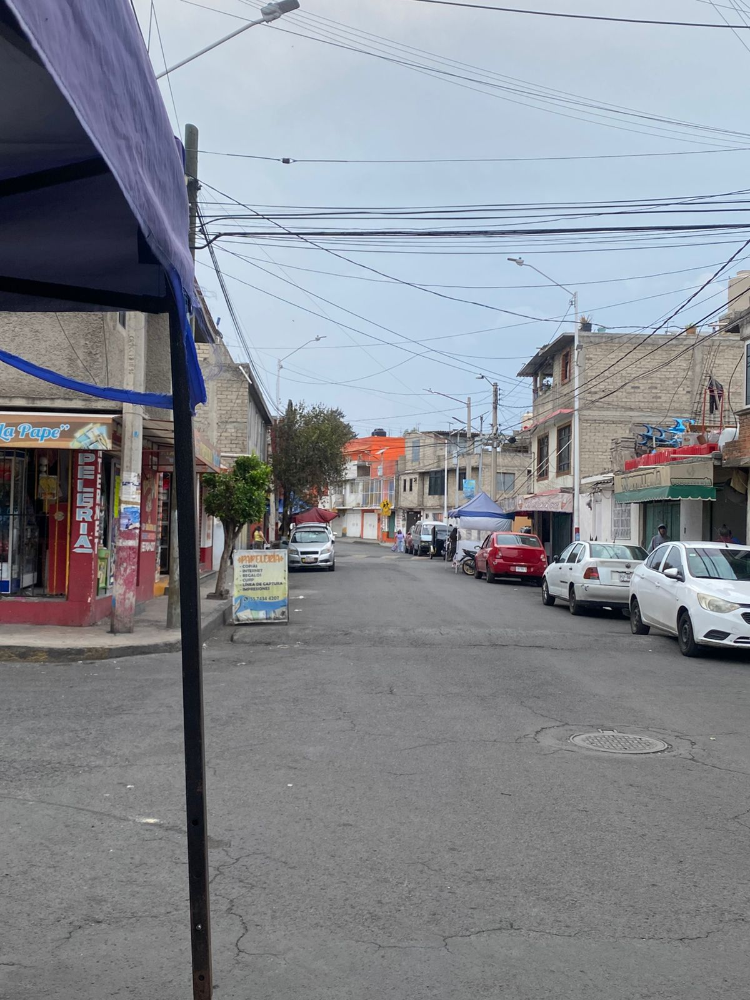

# Análisis de Mercado Local

El aguacate es uno de los productos favoritos al momento de comer. Se puede encontrar en supermercados, recauderías, mercados y "puestitos". Las personas pueden adquirirlo donde más les agrade. Teniendo variedad de lugares, el consumidor decide en qué lugar es conveniente por el costo, el precio o la calidad. Todos estos lugares viven la constante competencia por vender, pero… ¿qué hacen ellos para llamar la atención de los compradores? Las grandes cadenas tienen capacidad para invertir en publicidad y equipos de marketing. ¿Qué pasa con los pequeños negocios? ¿Cómo le hacen para que los clientes los elijan a ellos?

En este estudio lo averiguaremos. Hicimos un trabajo de campo en un pequeño puesto cercano a la casa de un alumno.

Variables de Aguacates Monarca

&#x20;

Demográficas: Ciudad de México, Tlahuac, colonia Los Olivos.&#x20;

Puesto situado en la calle.&#x20;

Temporal: ventas por día: 10/15 kg por dia.&#x20;

días de venta: lunes, miércoles, jueves, viernes, sabado, domingo.

Horario: 11:00 a 18:00 Hrs

día con mayor venta: sábado, domingo

Competencia: locales establecidos, mercado, tianguis los martes/viernes, supermercado

Precio: 70$ pesos por kilo en puesto, 60$ en locales, 64$ en mercado,

Flujo de transeúntes (plaza)puesto en la calle transitada.

clientes: Vecinos y personales cercanas al local.

Para cubrir esta materia, se generó una encuesta para conocer el gusto de clientes, vecinos, compañeros de la universidad, profesores y personas cercanas a los alumnos involucrados en el equipo. Las preguntas fueron basadas en el tema de las 7Ps visto en clase, lo que habla el tema es:

Producto (Product)\
Se refiere a lo que vendes, pero también a los beneficios y la experiencia que ofreces. No es solo el aguacate, sino su calidad, frescura, presentación y la garantía de que está en buen estado.&#x20;

Precio (Price)\
Es el costo que el cliente paga, pero también la percepción de valor. No se trata solo de ser el más barato, sino de que el cliente sienta que lo que paga vale lo que recibe. Plaza (Place)\
Es el lugar donde vendes y cómo el cliente accede a tu producto. Incluye tu ubicación física, la visibilidad del puesto, la facilidad para llegar, el horario de atención (11 a 18 hrs), y también si aceptas pedidos por teléfono o WhatsApp.

Promoción (Promotion)\
Son todas las acciones que haces para comunicar tu oferta y atraer clientes. En un puesto pequeño puede ser desde tener un letrero llamativo, ofrecer "2x1 al final del día", regalar un aguacate extra por cada kilo, hasta usar redes sociales (Facebook, WhatsApp) para avisar que llegó producto fresco.

Personas (People)\
Son las personas que atienden el puesto: el vendedor, su familia. La amabilidad, la honestidad (no engañar con el peso), la disposición a recomendar, la confianza que genera el vendedor es lo que hace que un cliente regrese, incluso si el precio es un poco más alto .

Procesos (Process)\
Son los pasos y procedimientos que sigues para que la compra sea ágil y placentera. Desde cómo seleccionas los aguacates, cómo los pesas, cómo los cobras, cómo entregas el cambio

Evidencia Física (Physical Evidence)\
Son todas las señales tangibles que le dan credibilidad y confianza al cliente. En un puesto, es la limpieza del lugar, la buena presentación de los aguacates, la báscula visible y calibrada, los carteles con precios claros, la higiene del vendedor (mandil, guantes), incluso la música o la iluminación.

<figure><figcaption>
Resultado de la encuesta, hecha a familiares, amigos y compañeros. imagen propia
</figcaption></figure>

Producto: Todo lo relacionado con características, calidad, estado y lo que buscan los clientes:

<figure><figcaption>
Los encuestados prefieren tener aguacates para comer al momento y otros para madurarlos. imagen propia
</figcaption></figure>

<figure><figcaption>
Hay gustos variados cuando se compra el aguacate. Imagen propia
</figcaption></figure>

<figure><figcaption>
El 32% de los encuestados compran un kilo, seguido de los que comprar por unidades. Imagen propia
</figcaption></figure>

Precio: todo lo relacionado con el costo.

<figure><figcaption>
La mayoria de los clientes tienen frecuencia en comprar este producto. Imagen propia
</figcaption></figure>

<figure><figcaption>
Las personas suelen tener un lugar cercano y de confianza. Imagen propia
</figcaption></figure>

<figure><figcaption>
La percepción del precio actual del aguacate para los clientes es dividida. Imagen propia
</figcaption></figure>

<figure><figcaption>
La mayoria decide seguir comprando, apesar si este sube de precio. Imagen propia
</figcaption></figure>

Promoción: información, comunicación, ofertas, etc...

<figure><figcaption>
Algunos siguen prefiriendo el trato directo y la atención del vendedor, mientras otros, les gustaria recibir el precio en plataformas digitales. Imagen propia
</figcaption></figure>

<figure><figcaption>
"La preferencia por carteles en el puesto (37%) supera ligeramente a WhatsApp (35%), lo que indica que los clientes aún valoran la comunicación visual directa en el punto de venta." imagen propia
</figcaption></figure>

Personas: Atención, relación con el vendedor, confianza:

<figure><figcaption>
La mayoría de los clientes compran aguacate para consumo familiar (80.2%), dejando muy por debajo la compra para uso personal o para negocio, lo que refuerza que el producto se percibe como un básico del hogar. Imagen propia
</figcaption></figure>

Proceso: Forma de comparar, facilidad de compra y forma de como se realizan los cobros:&#x20;

<figure><figcaption>
Más de la mitad de los clientes (57.4%) se enteran del precio del aguacate simplemente cuando pasan por el puesto y lo ven, lo que confirma que la decisión de compra sigue siendo impulsiva y visual, más que planificada o digital. imagen propia
</figcaption></figure>

Evidencia Física: Presentación, limpieza, imagen del lugar.

<figure><figcaption>
"Los clientes valoran de manera muy equilibrada las cuatro características principales del aguacate, siendo la frescura la que encabeza ligeramente la preferencia, pero sin que ninguna destaque de forma abrumadora." Imagen propia
</figcaption></figure>

¿Esto para que nos sirve?

Logramos entender que la decisión de compra de los clientes no depende únicamente del precio o la ubicación. Factores como la confianza en el vendedor (Personas), la rapidez, la frescura del producto (Producto) y la comunicación de ofertas (Promoción) son igual o más importantes para que un pequeño negocio compita con cadenas grandes y mercados. Identificamos áreas de mejora concretas, como el uso de WhatsApp para avisar de producto fresco, mejorar la señalización de precios y aprovechar los días de mayor afluencia (sábado y domingo) con promociones especiales.

Además, nos permite descubrir qué valoran realmente los vecinos y transeúntes: si prefieren pagar un poco más por mejor trato  o si la competencia del tianguis los martes y viernes es una amenaza real. En conclusión, un pequeño puesto puede competir sin gran presupuesto enfocándose en la experiencia del cliente, la confianza y la creatividad en la promoción.

<figure><figcaption>
"Infografía que resume los factores clave de decisión de compra en un pequeño negocio de aguacates: confianza en el vendedor, frescura del producto, rapidez en el servicio y promoción efectiva como el uso de WhatsApp." Imagen propia
</figcaption></figure>

Usando marketing y mineria de datos, encontramos patrones que nos dan información importante.

minería de patrones: market basket analysis

Se analizó la encuesta de clientes de aguacate para entender cómo se comportan los diferentes grupos de edad. Se revisaron las respuestas de tres preguntas clave: dónde compran, si el precio les parece accesible y qué harían si el precio sube.

Para hacer el análisis, se separaron los clientes por edad: jóvenes de 18 a 29 años, adultos de 30 a 49 años y mayores de 50 años. En cada grupo se identificó la respuesta más común, es decir, lo que la mayoría dijo.

Los resultados mostraron que los tres grupos coinciden en algo importante: todos sienten que el precio actual del aguacate no es accesible. Sin embargo, cada grupo reacciona diferente ante un posible aumento.

Mineria de marketing:

En  los canales de compra, la tabla que cruza edad con lugar muestra que los jóvenes prefieren fuertemente el tianguis, los adultos se reparten entre recauderías y tianguis, y los mayores se inclinan por los puestitos de la calle. El tianguis es el canal más usado en general, seguido por las recauderías. Sobre lo que más valoran los clientes al elegir un aguacate, los jóvenes priorizan la frescura, mientras que los adultos y mayores valoran más el sabor. Esto es importante para definir los mensajes de comunicación: para jóvenes se debe destacar la frescura, para adultos y mayores el buen sabor.

Uno de los hallazgos más importantes es el riesgo de abandono. Se calculó qué porcentaje de clientes dejaría de comprar si el precio sube. Los resultados muestran que el 60 por ciento de los jóvenes abandonaría temporalmente, el 30 por ciento de los adultos reduciría su consumo pero no dejaría de comprar, y los mayores también tienen un alto porcentaje de abandono. En términos totales, aproximadamente la mitad de los clientes está en riesgo de dejar de comprar si el precio aumenta.

 

