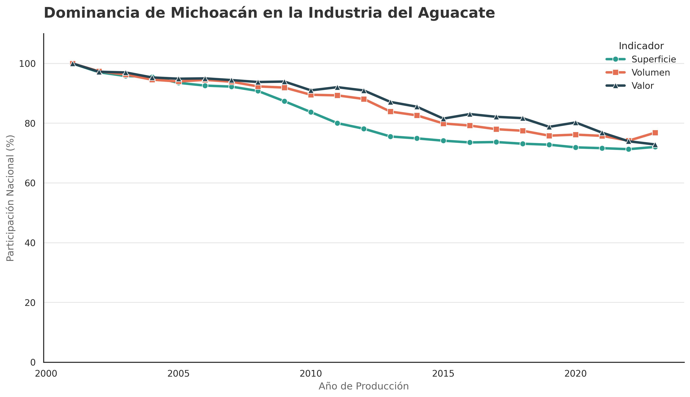

# Fuentes de Datos



<figure><figcaption>
Porcentaje de participación de Michoacán en la producción de aguacate en México. Elaboración propia con datos del Servicio Nacional de Sanidad, Inocuidad y Calidad Agroalimentaria (SENASICA).
</figcaption></figure>



