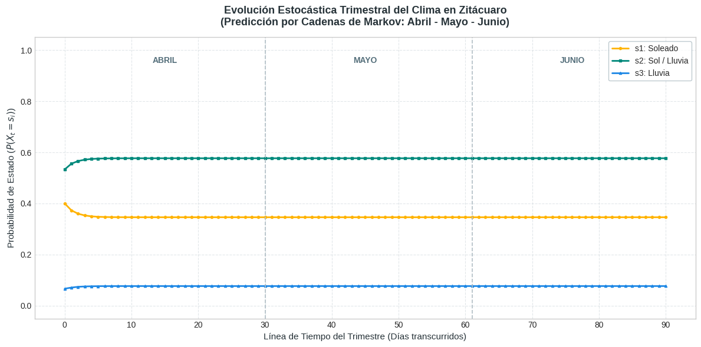

# Simulación Estocástica (Cadenas de Markov)

#### &#x20;Simulación del Clima Trimestral

El objetivo de este análisis fue anticipar y evaluar las condiciones del clima en Zitácuaro, Michoacán, durante el trimestre de abril, mayo y junio, ya que las lluvias y el sol afectan directamente la calidad, el riego y el control de plagas en la huerta de **Aguacates Monarca**. En lugar de adivinar o confiar en un pronóstico del día a día, utilizamos un modelo matemático probabilístico (Cadenas de Markov) para analizar cómo cambia el clima basándonos en los datos reales del inicio de la temporada.El resultado final nos muestra con total claridad hacia dónde se estabiliza el trimestre: **el 50% de los días serán mixtos (mañanas de sol con chubascos por la tarde), el 37.5% serán días completamente soleados y el 12.5% serán días de lluvia continua**. Esto significa que **el 62.5% del trimestre presentará algún tipo de evento pluvial**, lo cual es una gran noticia porque nos permite suspender el bombeo eléctrico y ahorrar dinero en riego.Al mismo tiempo, el modelo nos advierte con exactitud matemática que debemos programar fumigaciones preventivas debido a la alta humedad constante, garantizando que el aguacate mantenga su calidad premium antes de ser trasladado al punto de venta.

<figure><figcaption></figcaption></figure>

>
>
> > **Figura X. Evolución Estocástica Trimestral y Convergencia al Estado Estable del Clima.** _Nota:_ La gráfica ilustra la proyección probabilística multipaso para el trimestre de transición agrícola (abril, mayo y junio) en Zitácuaro, Michoacán, modelada mediante Cadenas de Markov. Las trayectorias reflejan cómo el sistema, partiendo de las condiciones reales registradas al inicio de la temporada, experimenta una rápida estabilización transitoria durante los primeros quince días. A partir de ese punto, las curvas convergen de forma asintótica y paralela hacia el vector de estado estable del microclima regional, fijando las probabilidades diarias definitivas en un 50.0% para el estado mixto de Sol/Lluvia (s\_2), un 37.5% para días Soleados (s\_1) y un 12.5% para escenarios de Lluvia Continua (s\_3).
> >
> > Las líneas discontinuas delimitan los cierres mensuales dentro de la simulación temporal de 91 días.Fuente: Elaboración propia mediante la implementación del producto estocástico matricial en Python, 2026.
