```mermaid
graph TD
    %% Estilos de los nodos
    classDef extraccion fill:#e1f5fe,stroke:#0288d1,stroke-width:2px,color:#000
    classDef limpieza fill:#fff3e0,stroke:#f57c00,stroke-width:2px,color:#000
    classDef transformacion fill:#e8f5e9,stroke:#388e3c,stroke-width:2px,color:#000
    classDef salida fill:#f3e5f5,stroke:#7b1fa2,stroke-width:2px,color:#000

    subgraph Pipeline_A [Pipeline A - Microeconomia y Precios]
        A1["📥 1. Extracción<br>Web Scraping (BeautifulSoup)<br>717,114 registros brutos"]:::extraccion --> A2["🧹 2. Limpieza Estructural<br>Desduplicación (33% conservado)<br>Realineación de columnas"]:::limpieza
        A2 --> A3["⚙️ 3. Transformación<br>Ingeniería de Características (Kg)<br>Filtro Z-Score dinámico (Outliers)"]:::transformacion
        A3 --> A4["📈 4. Serie de Tiempo (ARIMA)<br>Aislamiento: CEDA Iztapalapa, Caja 9kg<br>Interpolación Lineal Pandas"]:::salida
    end

    subgraph Pipeline_B [Pipeline B - Macroeconomia y Rendimiento]
        B1["📥 1. Extracción<br>API Power BI (JSON)<br>404 registros base"]:::extraccion --> B2["🧹 2. Ingesta y Auditoría<br>Entorno PySpark<br>Verificación 0% Nulos"]:::limpieza
        B2 --> B3["⚙️ 3. Transformación Escalar<br>Ajuste de Magnitudes lineales<br>(Miles de Ha, Millones MXN)"]:::transformacion
        B3 --> B4["📤 4. Exportación<br>Forzado de partición única<br>Salida .CSV estandarizada"]:::salida
    end
```

# Extracción y Limpieza

Se consultaron en el Sistema Nacional de Información e Integración de Mercados (SNIIM) los precios del aguacate Hass de primera, abarcando el periodo desde 2001 hasta 2026. Mediante un proceso de _web scraping_ utilizando la librería BeautifulSoup de Python, se lograron extraer 717,114 registros conformados por 8 columnas: Fecha, Presentación, Origen, Destino, Precio Min, Precio Max, Precio Frec y Obs.

Para la limpieza inicial de la base de datos, se eliminaron 478,076 registros duplicados, conservando 239,038 registros, los cuales representan el 33.33% del total extraído inicialmente. Al analizar la distribución de valores nulos, se identificó que la información de un bloque considerable de filas se había desplazado de forma errónea, lo que dejaba la columna 'Precio Min' vacía y arrojaba valores numéricos en la columna 'Obs'. Para corregirlo, se realinearon condicionalmente los datos: los valores de 'Precio Max' pasaron a 'Precio Min', 'Precio Frec' a 'Precio Max', y 'Obs' a 'Precio Frec'.

Posteriormente, se aplicó minería de textos a la columna 'Obs', filtrando _stop words_ para analizar las frecuencias de las palabras principales por año. Al concluir que esta columna no aportaba información relevante para el modelado, fue eliminada. Se procedió a descartar las filas que aún contenían valores nulos, consolidando un conjunto de 231,678 registros (un 96.92% de retención sobre los datos no duplicados).

Dado que los precios registrados dependían de 35 tipos de presentaciones diferentes, fue necesario estandarizar la variable de costo. Para ello, se extrajo la cantidad de kilogramos de la presentación utilizando expresiones regulares, aplicando excepciones manuales para categorías como "Kilogramo" (1 kg), "Manojo" (0.7 kg) y "Manojo de 10 pzas." (3 kg). A partir de este dato, se calculó una nueva variable denominada 'Precio Kg'. Asimismo, se extrajeron el año y el mes de la fecha original para facilitar particiones posteriores.

Para el tratamiento de valores atípicos (_outliers_), se implementó el cálculo de un _Z-Score_ dinámico basado en una ventana móvil de 90 días, particionada por origen y destino, lo que permitió obtener la media y la desviación estándar temporal. Se eliminaron 1,081 registros que superaban un umbral de 5 desviaciones estándar, resultando en un _dataset_ validado de 227,754 registros.

Previo al almacenamiento, la columna 'Destino' se limpió de comillas y caracteres especiales para luego dividirse en dos nuevas variables: 'estado\_destino' y 'centro\_distribucion'. Este conjunto procesado final se exportó en formato `.parquet`.

Finalmente, para el desarrollo de la proyección con el modelo ARIMA, se construyó una serie de tiempo específica filtrando los registros dirigidos a la Central de Abasto de Iztapalapa en el estado destino 'DF', centrándose exclusivamente en la presentación 'Caja de 9 kg.'. Los precios por kilogramo se promediaron mensualmente para el periodo de 2018 a 2026. Para asegurar la continuidad temporal necesaria en modelos autorregresivos, se eliminaron los meses futuros sin registros y se aplicó una interpolación lineal mediante Pandas para imputar los meses faltantes de los años 2020, 2021 y 2022, guardando el resultado definitivo en un archivo `.csv`.



En el caso de la producción de Aguacate, se consultó al Servicio Nacional de Sanidad, Inocuidad y Calidad Agroalimentaria. Dado que los datos eran solicitados a una API de Power BI, se usó el análisis de las respuestas en formato json y se recolectaron 405 registros que van desde el 2001 hasta el 2023. Las columnas que conforman este dataset son: Estado, Superficie Sembrada en hectáreas (ha), Volumen Cosechado en Toneladas, Valor que tiene la Cosecha en Pesos Mexicanos y Año de análisis.

Se procesó la base de datos de producción agrícola de aguacate Hass en la pagina del Servicio Nacional de Sanidad, Inocuidad y Calidad Agroalimentaria (SENASICA), la cual abarca el periodo histórico de 2001 a 2023, obteniendo 404 filas. En una primera etapa, los datos eran solicitados a una API de Power BI, se usó el análisis de las respuestas en formato json y posteriormente fue exportado como un archivo `.csv` para optimizar su ingesta. Después, la información se cargó en un entorno de PySpark aplicando un esquema de datos estructurado conformado por cinco variables principales: Estado, Superficie\_Ha, Volumen\_Ton, Valor\_MXN y Anio.

Durante la fase de auditoría de calidad de datos, se calculó la frecuencia y el porcentaje de valores nulos por columna. Los resultados confirmaron que el conjunto de datos, compuesto por 404 registros, estaba completamente íntegro, presentando un 0% de campos vacíos en todas sus variables. A partir de este _dataset_ completo, se generó un resumen estadístico para analizar la distribución, los promedios y los valores atípicos a lo largo de los 23 años analizados.

Para facilitar el manejo numérico y evitar problemas de escala geométrica en futuros modelos predictivos, se aplicó una transformación lineal a las variables de magnitud. La columna de superficie original ('Superficie\_Ha') se dividió entre 1,000 para expresarse como 'Superficie\_miles\_Ha'. Siguiendo esta misma estandarización, el volumen de cosecha ('Volumen\_Ton') se dividió entre 1,000 para renombrarse como 'Volumen\_miles\_Ton', mientras que el valor económico ('Valor\_MXN') se redujo por un factor de 1,000,000, consolidándose como 'Valor\_millones\_MXN'.

Finalmente, el conjunto de datos transformado se empaquetó forzando una única partición en PySpark y se exportó exitosamente como un archivo `.csv`. Este proceso dejó la serie temporal estandarizada, documentada y lista para su integración en análisis posteriores.



<figure><figcaption></figcaption></figure>
