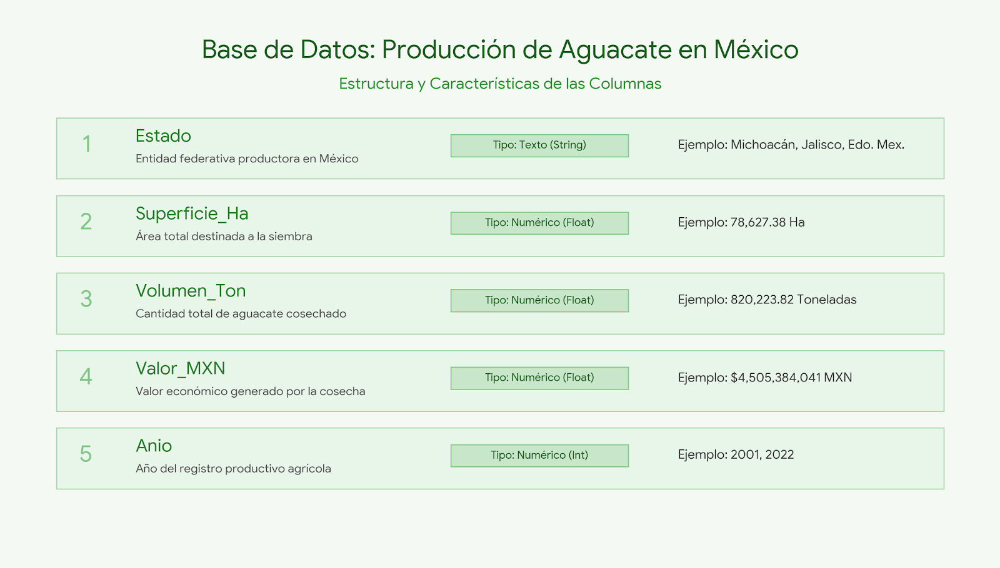

# Fuentes de Información

Para garantizar la validez, transparencia y rigurosidad del estudio de caso enfocado en la empresa "Aguacates Monarca", el análisis se fundamentó en la extracción y procesamiento de datos provenientes de dos de las instituciones gubernamentales más importantes en el monitoreo del sector agroalimentario en México.

La utilización de estas fuentes oficiales permite entender la dinámica de la cadena de suministro desde el cultivo hasta la comercialización, proporcionando la base empírica necesaria para democratizar la información y brindar herramientas de anticipación a los pequeños productores frente a la volatilidad del mercado.

**Sistema Nacional de Información e Integración de Mercados (SNIIM)**

El SNIIM, operado por la Secretaría de Economía, es el sistema oficial encargado de monitorear y transparentar el comportamiento de los precios al mayoreo de productos agrícolas en las principales Centrales de Abasto de la República Mexicana.

* Naturaleza de los datos: Se construyó un _dataset_ histórico enfocado en la comercialización del aguacate Hass de primera calidad, abarcando un horizonte temporal diario desde el año 2001 hasta 2026.
* Variables clave: La base de datos captura la trazabilidad comercial mediante variables como el Estado de origen, el centro de distribución destino (ej. Central de Abasto de Iztapalapa), la presentación del producto (cajas, arpillas y kilogramos) y la fluctuación del costo (Precio Mínimo, Precio Máximo y Precio Frecuente).
* Aplicación en el proyecto: Esta información, obtenida mediante técnicas de _web scraping_, es el núcleo del análisis microeconómico. Permite mapear la volatilidad de los precios de venta y nutre directamente el modelo autorregresivo (ARIMA) para predecir los costos de la caja de 9 kg en 2026, así como los cálculos de optimización mediante programación lineal para el abastecimiento del punto de venta en Tláhuac.

<figure><figcaption>
Imagen descriptiva sobre las caracteristicas de la base de datos del sniim. Elaboración propia.
</figcaption></figure>

**Servicio Nacional de Sanidad, Inocuidad y Calidad Agroalimentaria (SENASICA)**

SENASICA es el órgano desconcentrado de la Secretaría de Agricultura y Desarrollo Rural (SADER) responsable de proteger los recursos agrícolas y regular la producción nacional. A través de sus reportes estadísticos, ofrece una radiografía exacta del rendimiento de la tierra en el país.

* Naturaleza de los datos: Se procesó un padrón histórico anual que documenta la producción agrícola del aguacate Hass a nivel estatal, abarcando el periodo ininterrumpido de 2001 a 2023.
* Variables clave: El conjunto de datos está estructurado en torno a indicadores de volumen y valor, destacando la Entidad Federativa (Estado), la Superficie Sembrada (en hectáreas), el Volumen Cosechado (en toneladas) y el Valor de la Producción (en millones de pesos mexicanos).
* Aplicación en el proyecto: Estos registros componen la base del análisis macroeconómico. Al estandarizar las magnitudes de superficie y volumen, los datos alimentan la regresión polinomial para evaluar las tendencias de crecimiento nacional y sostienen el entrenamiento del árbol de regresión. Este modelo permite proyectar el rendimiento de toneladas por hectárea en Michoacán, justificando estratégicamente la ubicación de los cultivos de la empresa.

<figure><figcaption>
Imagen descriptiva sobre las caracteristicas de la base de datos del senasica. Elaboración propia.
</figcaption></figure>

<figure><figcaption></figcaption></figure>
