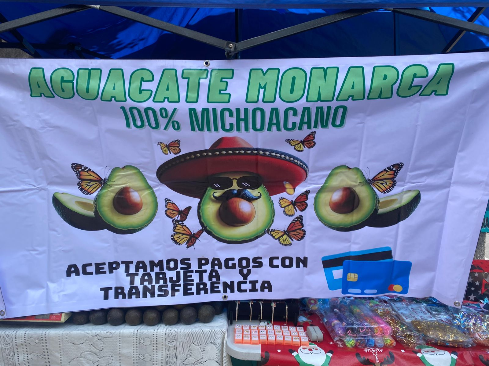

# Estudio de Caso "Aguacates Monarca"

Es una micro empresa atendida por la familia Herrera Medina, principalmente por la señora Reyna Medina, quien nos proporcionó la información para elaborar este proyecto.

El puesto se ubica en la alcaldía Tláhuac, colonia Los Olivos. Todos los días a las 10 a.m., la señora Reyna saca su puesto para ofrecer su producto: el aguacate.

Todos los micro negocios que vemos cerca de casa buscan satisfacer a los compradores trayendo lo mejor. "Aguacates Monarca" lo hace. Su nombre se basa en la mariposa monarca que hace estancia en Michoacán.

No fue por azares del destino que eligió vender este producto. Ella es originaria de Zitácuaro, Michoacán, estado famoso por producir el mejor aguacate del mundo. Lleva años radicando en la ciudad y hace 6 años decidió iniciar su negocio, que esta cercano a su casa

Pero, ¿qué pasa con lo que rodea su emprendimiento? ¿Cuál es el camino del aguacate desde que está en el árbol hasta que llega a nuestras mesas? ¿Será esa la forma más óptima?

El puesto enfrenta una competencia constante con recauderías, mercados y supermercados. Sin embargo, a pesar de ello, ha logrado mantener la preferencia de sus clientes gracias a que ofrece un producto de buena calidad.

<figure><figcaption>
Lona publicitaria del micronegocio. Imagen propia
</figcaption></figure>

<figure><figcaption>
Cercano al puesto se pueden encontrar locales donde se oferta el mismo producto y las personas siempre pueden elegir en donde comprar. Imagen propia
</figcaption></figure>

<figure><figcaption>
Otra opción son los supermercados, donde venden el producto embolsado, sin madurar y cerrado. Si buscas solo una pieza o comerlo al momento, tendrás que esperar unos días. Imagen propia
</figcaption></figure>

