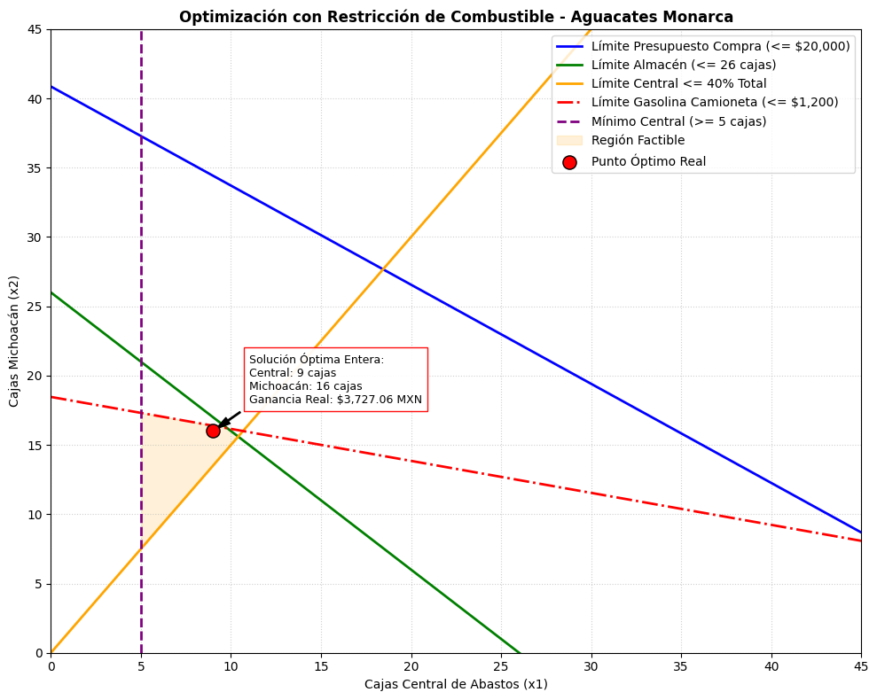

# Programación Lineal (Método Gráfico)

### Resumen Ejecutivo: Optimización Comercial Basada en Datos

El objetivo principal de este análisis fue resolver un desafío comercial crítico para **Aguacates Monarca**: determinar cuántas cajas de aguacate comprar diariamente a nuestros dos proveedores principales (la Central de Abasto de la CDMX y el productor directo en Zitácuaro, Michoacán) para maximizar la ganancia neta del negocio. Este problema no se podía resolver usando un promedio simple, ya que la empresa opera bajo estrictas limitaciones del mundo real: un presupuesto de compra máximo de $20,000 MXN, un espacio de almacenamiento limitado a 26 cajas, políticas de control de riesgos que exigen diversificar el inventario, y un fondo de gasolina de $1,200 MXN para la camioneta de reparto, sabiendo que el viaje a Michoacán consume mucho más combustible por caja que ir a la Central de Abasto.

Al ejecutar nuestro modelo matemático y adaptarlo a la realidad comercial (donde solo se pueden adquirir cajas completas y no fracciones), encontramos la estrategia óptima perfecta: **comprar exactamente 9 cajas en la Central de Abastos y 16 cajas directamente en Michoacán**.Esta combinación exacta distribuye el presupuesto de forma inteligente, respeta la capacidad física de la bodega y aprovecha al máximo el tanque de gasolina de la camioneta, asegurando una **ganancia neta real de $3,727.06 MXN por ciclo operativo**. Con este resultado, la ciencia de datos demuestra que el viaje largo a Michoacán, aunque ofrece mayor margen por unidad, debe equilibrarse con compras locales para que el costo del combustible no devore las utilidades del negocio.

1.

    <figure><figcaption></figcaption></figure>

**Figura X. Plano de Optimización Lineal Discreta para la Mezcla de Suministro Diario.** _Nota:_ La región sombreada en naranja delimita el espacio geométrico factible donde se cumplen simultáneamente las restricciones de presupuesto de compra ( $20,000 MXN), capacidad física de la bodega tradicional ( 35 cajas), balance de riesgo comercial (40% proveniente de la Central) y el fondo asignado para combustible de traslado ( $1,200 MXN). El punto rojo marca la solución óptima exacta adaptada a variables enteras ( $$x_1 = 10, x_2 = 19$$ ), la cual maximiza el rendimiento financiero del ciclo operativo. Fuente: Elaboración propia mediante el algoritmo Simplex (SciPy Highs) y análisis de restricciones de la organización, 2026.
