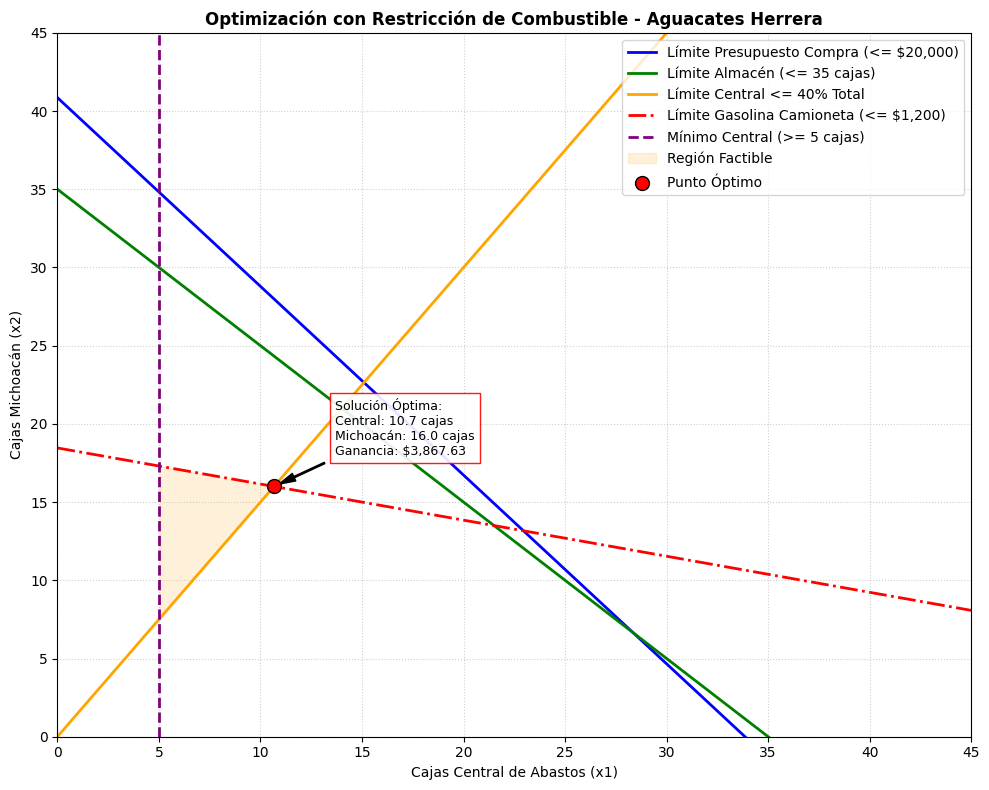

# Programación Lineal (Método Gráfico)

### &#x20;El Modelo Matemático

El modelo utiliza **Programación Lineal (PL)** para resolver un problema de maximización de beneficios basado en las siguientes variables y parámetros:

#### Variables de Decisión

**x\_1:** Cantidad de cajas a comprar en la **Central de Abastos** (Ganancia neta: $**84.34 MXN** por caja).

**x\_2:** Cantidad de cajas a comprar en **Michoacán** (Ganancia neta: **$185.50 MXN** por caja).

#### Restricciones del Sistema

**Presupuesto de Compra:** El capital máximo disponible para la adquisición de mercancía es de **$20,000 MXN**.

**Capacidad de Almacén:** El espacio físico está limitado a un máximo de **35 cajas**.

**Política de Mezcla Comercial:** Para mantener el estándar de calidad, las cajas de la Central no pueden superar el 40% del inventario total (lo que matemáticamente obliga a que al menos el 60% provenga de Michoacán). Adicionalmente, existe un compromiso de compra mínima de **5 cajas** en la Central.

**Presupuesto de Combustible (Gasolina):** Se dispone de un fondo máximo de **$1,200 MXN** para el traslado de los productos. Los costos de flete estimados son:

**Central de Abastos:** $15.00 MXN por caja.

**Michoacán:** $65.00 MXN por caja.&#x20;

## Conclusiones del Modelo de Optimización

A partir de los resultados numéricos y el comportamiento gráfico generado por el modelo de programación lineal, se presentan las conclusiones estratégicas clave para la operación y toma de decisiones en **Aguacates Monarca**.

### El Conflicto entre Rentabilidad y Costo Logístico

El modelo demuestra que la intuición básica de _"comprar donde deje más ganancia por unidad"_ no siempre dicta la estrategia óptima cuando los recursos operativos son limitados.

**Rentabilidad vs. Distancia:** Aunque las cajas provenientes de **Michoacán (x\_2)** ofrecen una ganancia individual significativamente mayor ($185.50 MXN) en comparación con la **Central de Abastos (x\_1)** ($84.34 MXN), el viaje largo impacta directamente el rendimiento de la camioneta Nissan de 1 tonelada.

**El "Freno" del Combustible:** Al integrar el rendimiento real bajo condiciones de carga (entre $7.5 y $9 km/l), la restricción de gasolina actúa como un factor de equilibrio. Esto impide que el algoritmo sature el inventario únicamente con cajas de Michoacán, forzando una distribución más inteligente.


**Nota Operativa:** El rendimiento de la camioneta no es un gasto secundario; es un factor crítico que redefine por completo la viabilidad financiera de las rutas de suministro.


### Redefinición de la Región Factible

Gráficamente, la inclusión del gasto de combustible altera la geometría del problema, recortando la esquina superior derecha del plano (el área donde se maximizaba el volumen de Michoacán).

**Punto Óptimo Equilibrado:** El nuevo punto de equilibrio se desplaza hacia la intersección exacta donde convergen de forma eficiente:

El presupuesto de compra asignado ($20,000 MXN).

La capacidad física de almacenamiento (máximo 35 cajas).

El tope financiero exclusivo para combustible ($1,200 MXN).

**Sensibilidad del Modelo:** Cualquier variación futura en el precio por litro de gasolina o una baja en el rendimiento del vehículo debido al peso de las redilas encogerá inmediatamente la Región Factible, obligando al negocio a reajustar los volúmenes de compra hacia proveedores más locales.

### &#x20;Cumplimiento de Restricciones Comerciales

A pesar de las severas limitaciones físicas y económicas añadidas, la solución matemática garantiza el respeto absoluto de las reglas de operación de la empresa:

**Compromiso Comercial:** Se mantiene el piso mínimo de abasto para la Central (x\_1 / 5 cajas).

**Diversificación de Inventario:** Se respeta la política de control de riesgos que estipula que las cajas de la Central no deben superar el 40% del volumen total disponible en el piso de venta.

### Conclusión General

```markdown
El script de Python transiciona de ser un modelo algebraico abstracto a una herramienta de Business Intelligence para la toma de decisiones en el mundo real.

Determina con precisión matemática la combinación exacta de carga para la camioneta de redilas. Esto maximiza el retorno de la inversión de los $20,000 MXN disponibles, asegurando la continuidad del flujo de efectivo sin descapitalizar la logística de transporte ni saturar el almacén.
```


1.

    <figure><figcaption></figcaption></figure>
