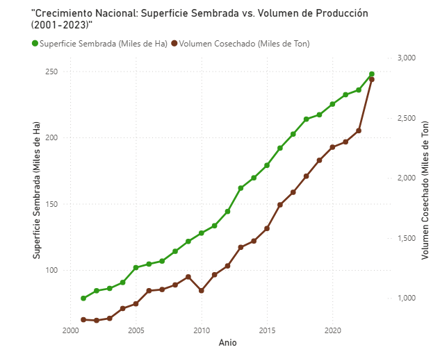
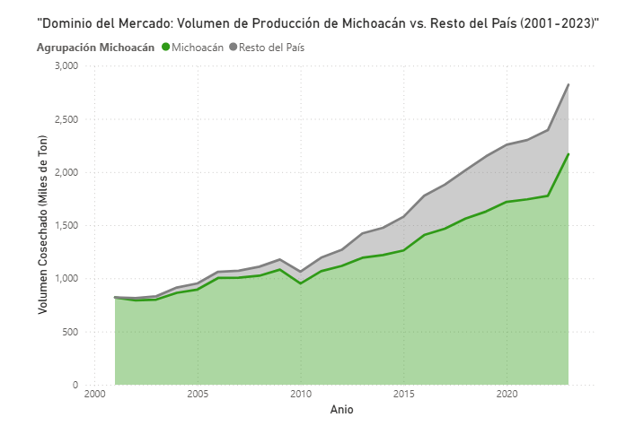
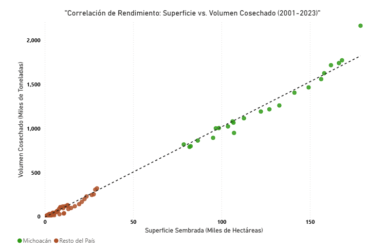

# Análisis Histórico Nacional y Estatal

Para comprender la dinámica del mercado que afecta directamente la cadena de suministro de Aguacates Monarca, es imperativo analizar el comportamiento de la producción de aguacate Hass a nivel nacional. Utilizando los registros oficiales del Servicio Nacional de Sanidad, Inocuidad y Calidad Agroalimentaria (SENASICA) correspondientes al periodo 2001-2023, se estructuró un análisis que evalúa tanto la expansión territorial del cultivo como su rendimiento volumétrico. Esta perspectiva histórica permite contextualizar la viabilidad y competitividad del modelo de negocio de la PyME.

A nivel macroeconómico, el sector aguacatero mexicano ha experimentado una expansión acelerada e ininterrumpida durante las últimas dos décadas. Como se observa en la evolución histórica nacional (Figura 1), existe una fuerte tendencia al alza tanto en la superficie sembrada como en el volumen de cosecha. Especialmente a partir de la década de 2010, el volumen de toneladas producidas ha seguido un ritmo de crecimiento sumamente paralelo a la expansión de las hectáreas cultivadas. Esta escalabilidad constante indica que el sector no solo ha ampliado su frontera agrícola, sino que ha logrado sostener la productividad, consolidando al aguacate como un producto de alta resiliencia comercial.

<figure><figcaption></figcaption></figure>

> Figura 1: Crecimiento Nacional: Superficie Sembrada vs. Volumen de Producción (2001-2023). _Elaboración propia con datos del SENASICA._

Al desagregar este crecimiento a nivel regional, la justificación de la ubicación estratégica de los cultivos de Aguacates Monarca se vuelve estadísticamente evidente. El análisis de la composición del mercado (Figura 2) revela que Michoacán ha mantenido un dominio productivo absoluto en comparación con la suma total del resto de las entidades federativas. Aunque en los años más recientes se percibe un ligero incremento en la participación de otros estados, la franja de producción michoacana continúa representando la abrumadora mayoría de la oferta nacional. Esta extrema concentración subraya la dependencia del país hacia esta región y explica por qué las fluctuaciones logísticas o climáticas en Michoacán impactan directamente los precios en la Central de Abasto de la Ciudad de México.

<figure><figcaption></figcaption></figure>

> Figura 2: Dominio del Mercado: Volumen de Producción de Michoacán vs. Resto del País (2001-2023). _Elaboración propia con datos del SENASICA._

Finalmente, para validar la eficiencia agrícola de la región frente a sus competidores, se evaluó la correlación entre la extensión de tierra cultivada y la producción resultante (Figura 3). El modelo de dispersión demuestra una correlación fuertemente lineal, donde Michoacán no solo destaca por poseer un territorio más vasto, sino por proyectar un rendimiento agrícola consistente a gran escala. La estela de observaciones michoacanas se separa claramente de la aglomeración de datos del resto del país, validando cuantitativamente la ventaja competitiva de la región. Esta evidencia confirma que la presencia agrícola de la empresa en Zitácuaro responde a un modelo estadísticamente superior, sentando las bases empíricas necesarias para el posterior modelado predictivo del rendimiento por hectárea.

<figure><figcaption></figcaption></figure>

> Figura 3: Correlación de Rendimiento: Superficie vs. Volumen Cosechado (2001-2023). _Elaboración propia con datos del SENASICA._
