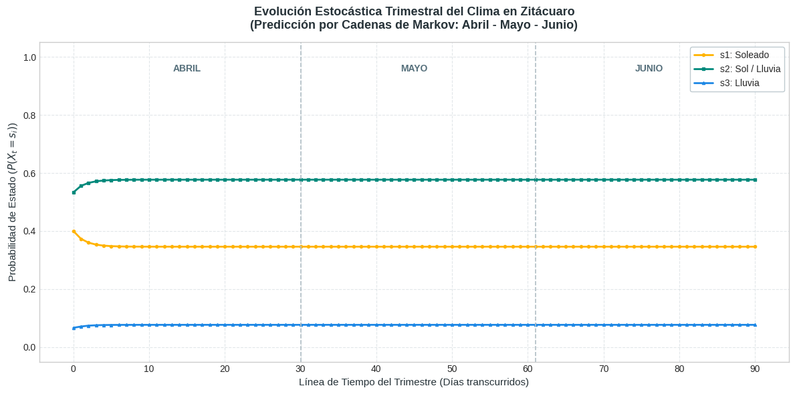

# Simulación Estocástica (Cadenas de Markov)

## Modelado Estocástico del Clima y Gestión Hídrica en Aguacates Monarca

### &#x20;Este análisis abarca un horizonte temporal de 91 días, cubriendo por completo el trimestre crítico de **abril, mayo y junio**.

El modelo matemático clasifica las condiciones meteorológicas de la región en tres estados fundamentales:

(Soleado): Días con alta radiación solar y nula precipitación.

(Sol / Lluvia): Estado mixto caracterizado por intervalos de chubascos aislados con periodos de sol.

&#x20; (Lluvia Continua): Días dominados por precipitaciones de tormenta o lluvia continua.

A partir del registro de frecuencias y transiciones reales observadas en la zona durante un muestreo de 30 días correspondiente a abril de 2026, el equipo decidimos estructurar la siguiente matriz de transición de estados \[ 17, 19, 61, 63, 64, 65, 89]:

$$P = \begin{pmatrix} \frac{8}{12} & \frac{4}{12} & \frac{0}{12} \\ \frac{3}{15} & \frac{10}{15} & \frac{2}{15} \\ \frac{0}{2} & \frac{2}{2} & \frac{0}{2} \end{pmatrix} = \begin{pmatrix} 0.667 & 0.333 & 0.000 \\ 0.200 & 0.667 & 0.133 \\ 0.000 & 1.000 & 0.000 \end{pmatrix}$$

Como punto de partida para la proyección trimestral, se utilizó el vector de probabilidad inicial  derivado de la distribución de la muestra real de abril, la cual registró 12 días soleados, 16 días mixtos y 2 días lluviosos\[ 19, 61, 80, 81, 104]:

$$v_{\text{inicial}} = \begin{pmatrix} \frac{12}{30} & \frac{16}{30} & \frac{2}{30} \end{pmatrix} \approx \begin{pmatrix} 0.4000 & 0.5333 & 0.0667 \end{pmatrix}$$

### &#x20;Influencia del Clima en la Cosecha de Aguacates Monarca

La interpretación agronómica de este modelo estocástico revela que **el 62.5% de los días del trimestre registrarán algún tipo de evento pluvial** (sumando el 50%de los días mixtos y el 12.5% de lluvias continuas). Para **Aguacates Monarca**, este escenario influye directamente en las distintas etapas de desarrollo del fruto de exportación:

**Desarrollo y Llenado del Fruto:** El aporte hídrico natural durante mayo y junio beneficia el crecimiento del aguacate Hass, reduciendo la dependencia inmediata de los sistemas de bombeo artificial y disminuyendo los costos operativos por consumo energético.

**Riesgo por Estrés Fitosanitario:** La combinación de humedad relativa elevada y temperaturas templadas del estado mixto genera el microclima ideal para la proliferación de patógenos fúngicos (como la _Phytophthora cinnamomi_ o tristeza del aguacate). Esto exige a la pyme programar monitoreos rigurosos y aplicaciones preventivas de control biológico o químico.**Lixiviación de Nutrientes:** En los suelos volcánicos de Zitácuaro, la concentración de lluvias continuas  puede lavar los nutrientes de la zona radicular, obligando a ajustar los planes de fertirriego para evitar deficiencias nutricionales en los árboles de la plantación.

<figure><figcaption></figcaption></figure>

>
>
> > #### Nota Técnica: Resumen de la Evolución Climática Trimestral
> >
> > La gráfica muestra la proyección estocástica del clima en Zitácuaro para el trimestre **Abril - Mayo - Junio** mediante Cadenas de Markov:
> >
> > &#x20;**Ajuste Inicial (Días 0 - 10):** Las curvas parten del registro real de abril (con alta presencia de días soleados y mixtos) , mostrando una breve transición y estabilización de las probabilidades.
> >
> > **Convergencia al Estado Estable (Días 15 - 90):** A partir de la segunda semana, las tendencias se vuelven horizontales. El sistema se estabiliza por completo y las probabilidades diarias quedan fijas en:
> >
> > **50.0% de días Mixtos (s\_2):** Mañanas con sol e intervalos de chubascos por la tarde.
> >
> > **37.5% de días Soleados (s\_1):** Radiación limpia, óptima para la fotosíntesis del cultivo.
> >
> > **12.5% de días Lluviosos (s\_3):** Precipitaciones continuas o tormentas.
> >
> > &#x20;**Conclusión para Aguacates Monarca:** La suma de los estados s\_2 y s\_3 demuestra que el **62.5% de los días del trimestre presentarán algún evento pluvial**. Esta constante matemática justifica plenamente la inversión en ollas de agua para capturar estos excedentes y asegurar el riego en las épocas de sequía.

###
